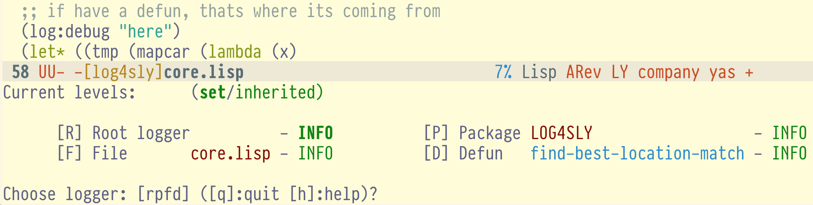

=========
 Log4SLY
=========

This package adds a ``C-c C-g`` shortcut which allows to setup ``log4cl's`` log levels
from Emacs. You will be able to set different levels for packages, files and function
definitions:

Installation
============

System is available at Ultralisp. Please, setup your quicklisp
client to use it as a source for packages:

.. code:: common-lisp

   (ql-dist:install-dist "http://dist.ultralisp.org/"
                         :prompt nil)

Next, download and setup ``log4sly``.

.. code:: common-lisp
   (ql:quickload :log4sly)

.. code:: common-lisp

   (log4sly:install)

the output should look like this
.. code:: common-lisp-repl

   CL-USER> (ql:quickload :log4sly)
   CL-USER> (log4sly:install)
   Wrote ~/projects/lisp/test-log4sly/.qlot/log4sly-setup.el
   
   Add the following two statements to your ~/.emacs file
   ------------------------------------------------------
   (load "~/projects/lisp/test-log4sly/.qlot/log4sly-setup.el")
   (global-log4sly-mode 1)
   ------------------------------------------------------

Credentials
===========

This system is based on log4slime, by Max Mikhanosh (max.mikhanosha@gmail.com).
